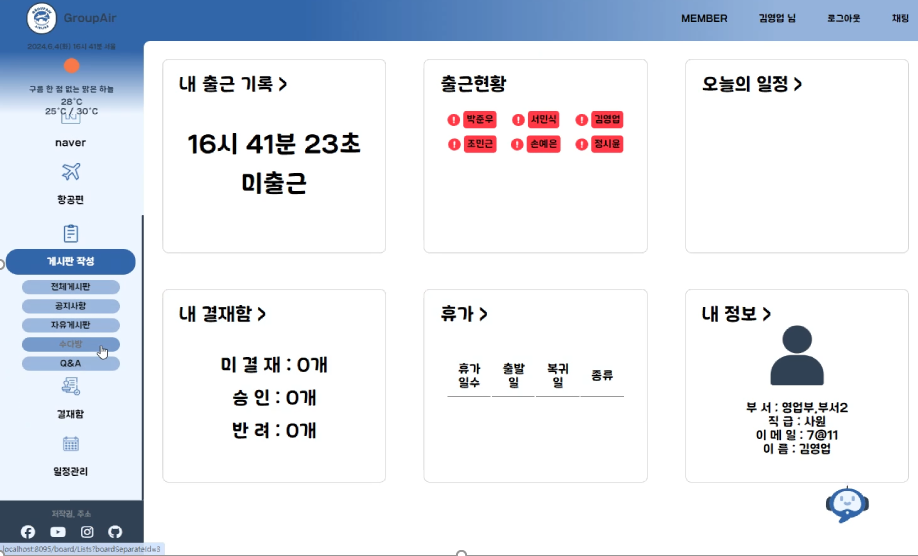
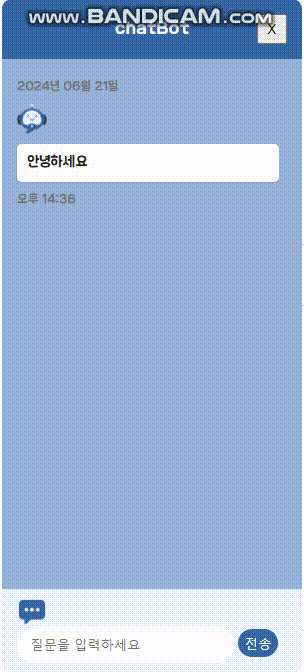

# project2 Groupware

## 2차 조별과제(5인) 그룹웨어(항공사) + 챗봇

 

기간: 23.05.09 - 23.06.05 

챗봇 제작 기간 : 23.06.12 - 23.06.28

배포:aws

### 개발환경

* 언어: java(jdk11), HTML/CSS , js, springboot, thymeleaf
* DB: MySQL

### 구현기능
* 근태관리 - 인사정보(CRUD), 근태현황, 휴가연차내역, 출근/조퇴/퇴근
* 급여관리
* 항공편관리
* 캘린더 - 일정등록,공유
* 게시판 - 사원게시판 
* 전자결재시스템
* 버스api 를 활용한 챗봇

### 담당

#### 전자결재 

* 로그인 권한에 따라 사원,승인자(부장) 페이지를 다르게구현
* 사원로그인 - 승인자를 선택하여 결재작성 -> 작성한결재는 자신의 상신함, 선택한승인자의 결재함 으로 이동
* 승인자(부장)로그인 - 결재함 이동시 사원이 작성한 결재를 확인가능 (자신에게 온 결재정보만 보임)
* 승인자가 승인/반려 선택시 사원의 상신함도 같이 업데이트 되어서 사원도 바로 확인가능

#### 버스api 챗봇

* 버스정보를 입력하면 정보가 나오는 시나리오형 챗봇
* 버스 공공api를 활용 DB에 저장된 정보가 나오도록 구현
* 코모란 한국어형태소분석기 활용

